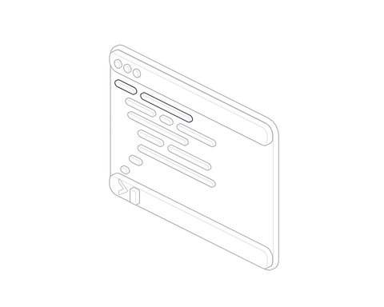
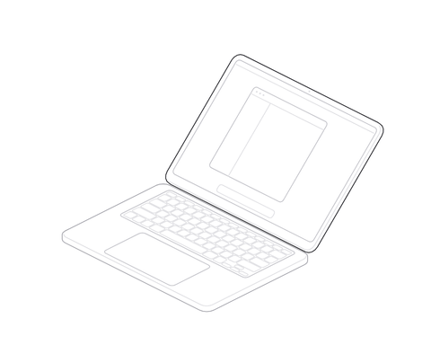
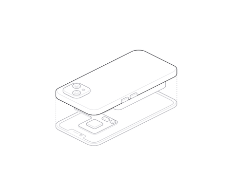

[LinkedIn](https://linkedin.com/in/aditya-bhoye-908597357) &nbsp;·&nbsp; [adibhoye@gmail.com](mailto:adibhoye@gmail.com) &nbsp;·&nbsp; [GitHub](https://github.com/Aditya-Bhoye)

## About

<table>
  <tr>
    <td valign="middle" width="60%">
      
I build Flutter apps, full-stack web apps and machine learning models.

      
I study B.E. Information Technology at PCCOE Pune and graduate in 2027.

      
I founded Veron, a point-of-sale system that runs in a bar in Pune.

    </td>
    <td align="center" width="40%">
      <picture>
        <source media="(prefers-color-scheme: dark)" srcset="assets/terminal-dark.gif" />
        
      </picture>
    </td>
  </tr>
</table>

## Featured: Veron

Veron is a point-of-sale and business management system for bars.
It operates in production in a bar in Pune.
Veron has a desktop till app and a phone app.
It does billing, inventory, staff roles and customer credit (udhaar).

<table>
  <tr>
    <td align="center" width="50%">
      <picture>
        <source media="(prefers-color-scheme: dark)" srcset="assets/laptop-dark.gif" />
        
      </picture>
       <b>Desktop till</b>
    </td>
    <td align="center" width="50%">
      <picture>
        <source media="(prefers-color-scheme: dark)" srcset="assets/phone-dark.gif" />
        
      </picture>
       <b>Phone app</b>
    </td>
  </tr>
</table>

**Stack:** Flutter · Dart · Supabase · PostgreSQL

  
  

## Tech stack

<table>
  <tr>
    <td><b>Languages</b></td>
    <td>
      
      
      
      
      
      
      
    </td>
  </tr>
  <tr>
    <td><b>Mobile</b></td>
    <td>
      
    </td>
  </tr>
  <tr>
    <td><b>Machine learning and data</b></td>
    <td>
      
      
      
      
    </td>
  </tr>
  <tr>
    <td><b>Backend and databases</b></td>
    <td>
      
      
      
      
    </td>
  </tr>
  <tr>
    <td><b>Web</b></td>
    <td>
      
    </td>
  </tr>
  <tr>
    <td><b>Tools</b></td>
    <td>
      
      
      
      
    </td>
  </tr>
</table>

## Projects

<table>
  <tr>
    <td valign="top" width="50%">
      <h3><a href="https://github.com/Aditya-Bhoye/Pulmoscan">PulmoScan</a></h3>
      
A web app classifies lung CT scans as normal, benign or malignant. It uses a ResNet-50 model.

      
<code>Python</code> <code>PyTorch</code> <code>Flask</code> <code>Firebase</code>

      <a href="https://github.com/Aditya-Bhoye/Pulmoscan">Repository</a>
    </td>
    <td valign="top" width="50%">
      <h3><a href="https://github.com/Aditya-Bhoye/Flox">Flox</a></h3>
      
A mobile app splits group expenses and predicts loan approval.

      
<code>Flutter</code> <code>Dart</code> <code>Supabase</code> <code>Python</code> <code>scikit-learn</code> <code>FastAPI</code>

      <a href="https://github.com/Aditya-Bhoye/Flox">Repository</a>
    </td>
  </tr>
  <tr>
    <td valign="top" width="50%">
      <h3><a href="https://github.com/Pranav-Harad/smartcharity">SmartCharity</a></h3>
      
A donation platform stamps each donation with a SHA-256 audit hash. Gemini writes the impact stories.

      
<code>React</code> <code>Tailwind</code> <code>Spring Boot</code> <code>MongoDB</code> <code>JWT</code> <code>Docker</code>

      <a href="https://smartcharity.vercel.app">Live</a> · <a href="https://github.com/Pranav-Harad/smartcharity">Repository</a> · Team project with Pranav Harad
    </td>
    <td valign="top" width="50%">
      <h3><a href="https://github.com/Aditya-Bhoye/Library-Management-System-Java">Library Management System</a></h3>
      
A console app issues books and saves records with serialization.

      
<code>Java</code> <code>Maven</code>

      <a href="https://github.com/Aditya-Bhoye/Library-Management-System-Java">Repository</a>
    </td>
  </tr>
</table>

## GitHub stats

  <picture>
    <source media="(prefers-color-scheme: dark)" srcset="https://raw.githubusercontent.com/Aditya-Bhoye/Aditya-Bhoye/output/stats-dark.svg" />
    
  </picture>

## 3D contribution graph

  <picture>
    <source media="(prefers-color-scheme: dark)" srcset="https://raw.githubusercontent.com/Aditya-Bhoye/Aditya-Bhoye/output/profile-3d-dark.svg" />
    
  </picture>

Figures: <a href="https://github.com/lucasmarkes/hairline">Hairline by Lucas Marques (MIT)</a>

